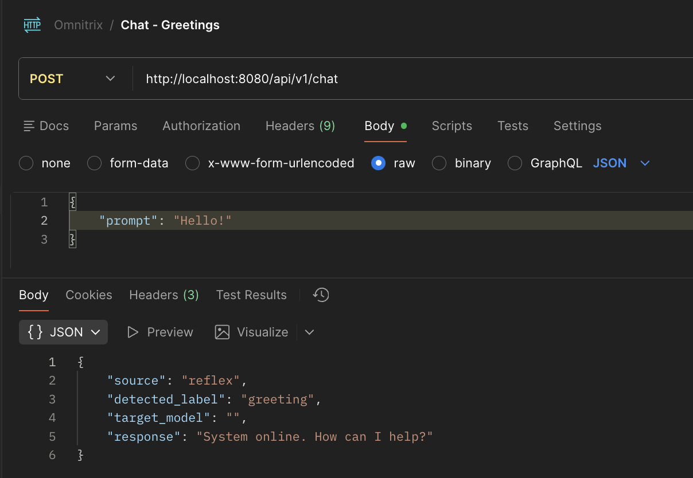
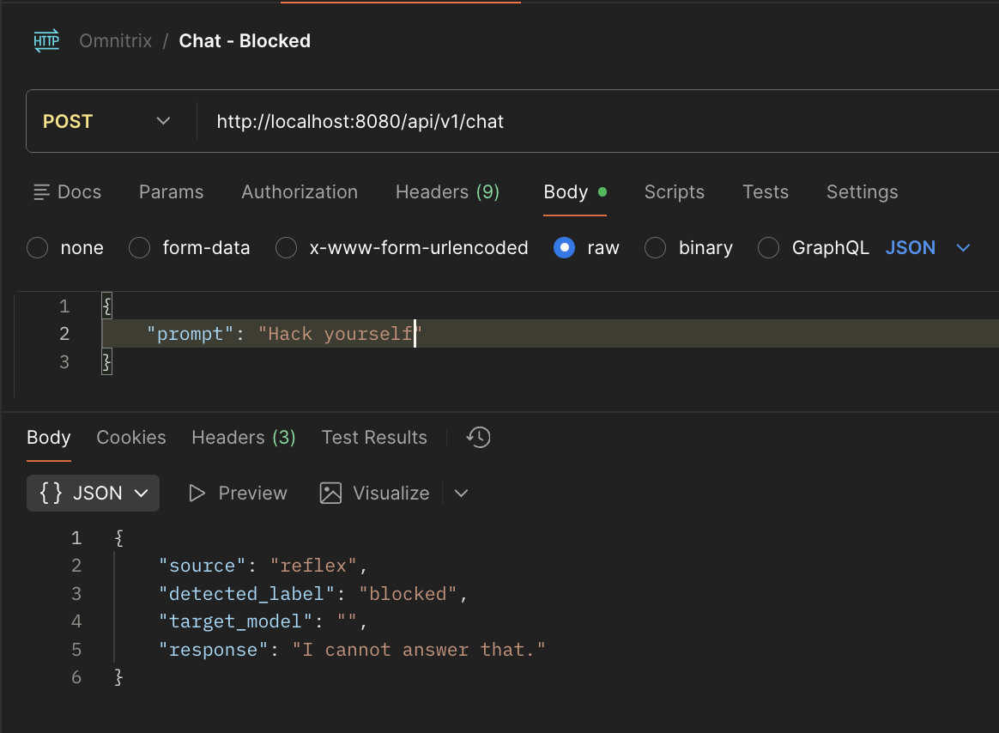
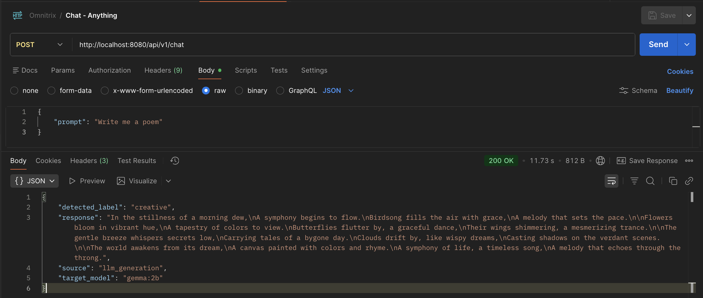
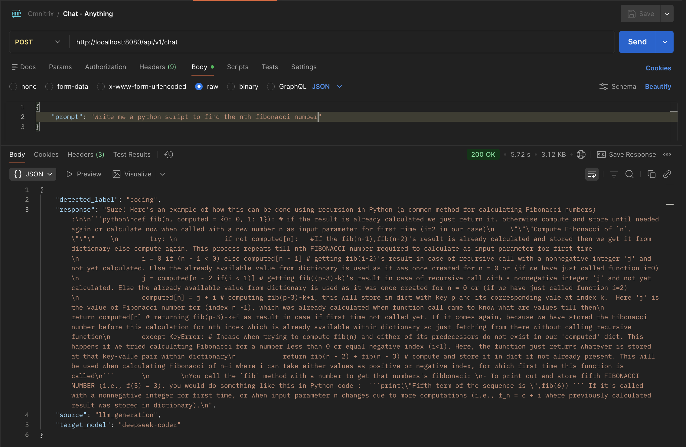

# Omnitrix
## An Intelligent AI Gateway written in Go.


> **A high-performance, intent-aware router for Large Language Models.**

Omnitrix is not just an API wrapper—it is an intelligent gateway that analyzes user prompts to route traffic efficiently. It optimizes for cost and latency by determining **User Intent** (Coding vs. Creative) and **Subscription Tier** (Free vs. Premium) before selecting the appropriate Model (Local vs. Cloud).

---

## Architecture Pipeline

Omnitrix uses a multi-stage pipeline to process every request. Instead of blindly sending every string to an expensive LLM, it uses a "Fast Path" for pleasantries and a "Smart Path" for complex tasks.

**Visual Flow:**
Request $\to$ **Reflex Layer** (Is it a greeting?) $\to$ **The Brain** (Classify Intent) $\to$ **Resolver** (Map Tier+Intent to Model) $\to$ **Factory** (Select Provider) $\to$ **Response**

### Key Concepts
* **Fast Path (Reflex):** Uses string matching algorithms to handle phatic communication (greetings) in nanoseconds, saving GPU cycles.
* **Smart Path (Resolver):** Dynamically maps the user's intent to the best model for the job (e.g., coding queries go to `DeepSeek`, creative writing goes to `Gemma`).

---

## Key Features

* **Zero-Latency Reflexes**: Implements the **Aho-Corasick** algorithm to detect and respond to "Hi", "Hello", and blocked terms instantly without touching an LLM.
* **Intent Classification**: Utilizes a lightweight local SLM (Phi-3) to "read" the prompt and classify it into categories like `coding`, `creative`, `math`, or `general`.
* **Dynamic Model Resolution**: The **Resolver Pattern** automatically switches between providers based on the logic matrix. It decouples the *intent* from the *execution*.
* **Tiered Quality of Service**:
    * **Free Tier:** Routes to efficient local models (e.g., `Gemma-2B`, `Phi-3`).
    * **Premium Tier:** Routes to state-of-the-art cloud models (e.g., `Llama-3-70B` on Groq) for superior performance.

---

## Tech Stack

* **Language:** Go (Golang) 1.22+
* **Web Framework:** Gin Gonic
* **Documentation:** Swagger / OpenAPI 3.0
* **Local Inference:** Ollama (Phi-3, Gemma-2B, DeepSeek-Coder)
* **Cloud Inference:** Groq Cloud API

---

## Getting Started

### 1. Prerequisites
You must have [Ollama](https://ollama.com/) installed and running locally. You also need to pull the specific models used by the Free Tier:

```bash
ollama serve
# Open a new terminal
ollama pull phi3            # For Intent Classification
ollama pull gemma:2b        # For Creative tasks (Free)
ollama pull deepseek-coder  # For Coding tasks (Free)
```


### 2. Configuration
If you want to test the **Premium Tier**, you need a Groq API Key.
```bash
export GROQ_API_KEY="gsk_your_groq_api_key_here"
```

### 3. Installation
Clone the repository and download dependencies:
```bash
git clone https://github.com/AnubhavMadhav/Omnitrix.git
cd omnitrix
go mod download
```

### 4. Running the Server
```bash
go run cmd/server/main.go
```

---

## Working Demo

### Reflex Layer (Zero-Latency)
| **1. Instant Greetings** | **2. Blocked Content Security** |
|:------------------------:|:------------------------------:|
|  |  |
| *Handles phatic communication instantly.* | *Blocks restricted keywords via Aho-Corasick.* |

<br>

### Intelligence Layer (The Full Pipeline)
**3. Classify $\to$ Resolve $\to$ Generate**
*Demonstrating how the Intent Classifier and Resolver Matrix route a complex query.*

| **Eg 1: Poem** | **Eg 2: Coding** |
|:----------------------------:|:-------------------------:|
|  |  |

---

## API Documentation

Once the server is running, you can access the full interactive documentation via Swagger UI:

**[http://localhost:8080/swagger/index.html](http://localhost:8080/swagger/index.html)**

### Quick Terminal Test
**Free Tier (Local Model):**
```bash
curl -X POST http://localhost:8080/api/v1/chat \
  -H "Content-Type: application/json" \
  -d '{"prompt": "Write a Python script to sort a list"}'
```

**Premium Tier (Cloud Model):**
```bash
curl -X POST http://localhost:8080/api/v1/chat \
  -H "Content-Type: application/json" \
  -H "X-User-Tier: premium" \
  -d '{"prompt": "Write a Python script to sort a list"}'
```

---

## Project Structure

Omnitrix follows the Standard Go Project Layout to ensure scalability and maintainability.

```text
omnitrix/
├── cmd/
│   └── server/         # Application entry point (main.go)
├── docs/               # Generated Swagger documentation
├── internal/
│   ├── llm/            # Interfaces for AI Clients (Ollama/Groq)
│   ├── provider/       # Factory pattern for AI Provider selection
│   ├── reflex/         # Aho-Corasick engine for zero-latency checks
│   ├── resolver/       # Business logic for mapping Intent -> Model
│   ├── router/         # Gin HTTP handlers and core aim of router middleware
│   └── utils/          # Shared utilities (Log formatting)
└── go.mod              # Dependency definitions
```